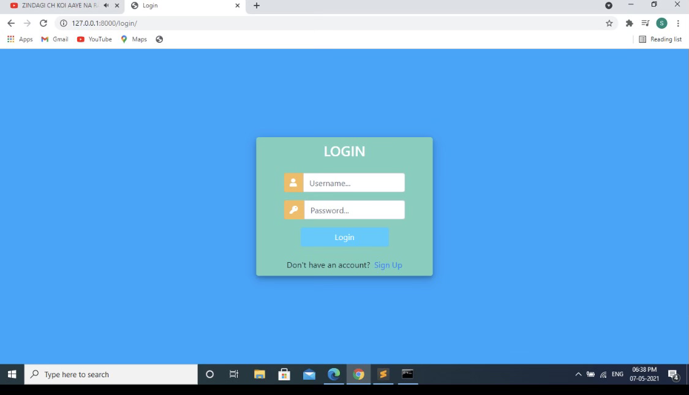
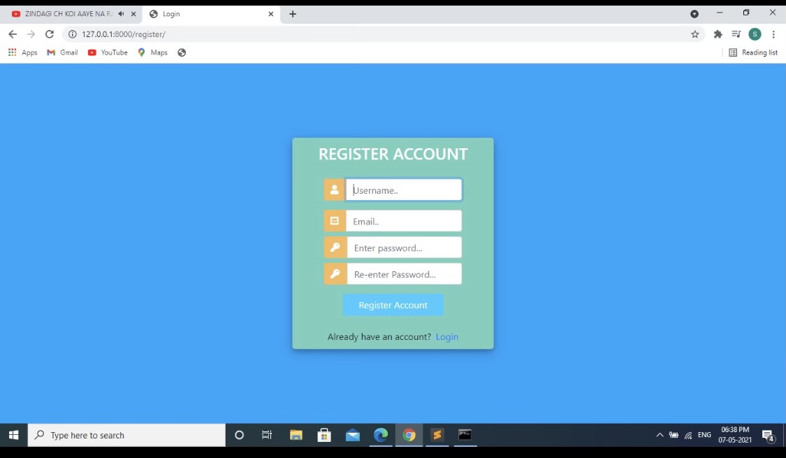
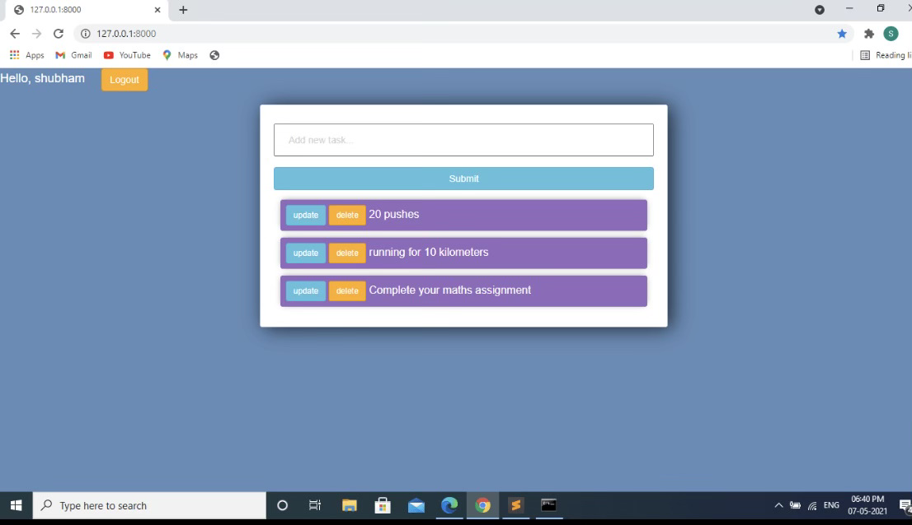

# mywebsite
* The link to my website --> http://127.0.0.1:8000/login/?next=/

* In Order to open the my website you have to follow the steps listed below. Which will take you to the Login Page. if you have don't have a username created on my website you would be able to register it and once you register it. Login with your username which will allow you to go to the note page. Where you would be able to add the note or edit it, even delete the note if required.

# The steps in the command:
* py -m pip install --user django
* cd OneDrive
* cd Desktop
* cd mywebsite-master
* py manage.py runserver

# running server at: http://127.0.0.1:8000/
* When clicked the link the login page is at http://127.0.0.1:8000/login/?next=/.

# webister working video:

[View mywebsite Video Here] (https://share.vidyard.com/watch/nPnKzw9Gc7qiQm2JApLNjm?vyetoken=aba83b44-330a-4b52-88b3-10103bd45d22&autoplay=1)

# mywebsite Login Page

# mywebsite Register Page

# mywebsite Note Page

# Author:
* Jay Lakhani
* Siddharth Vermuri

